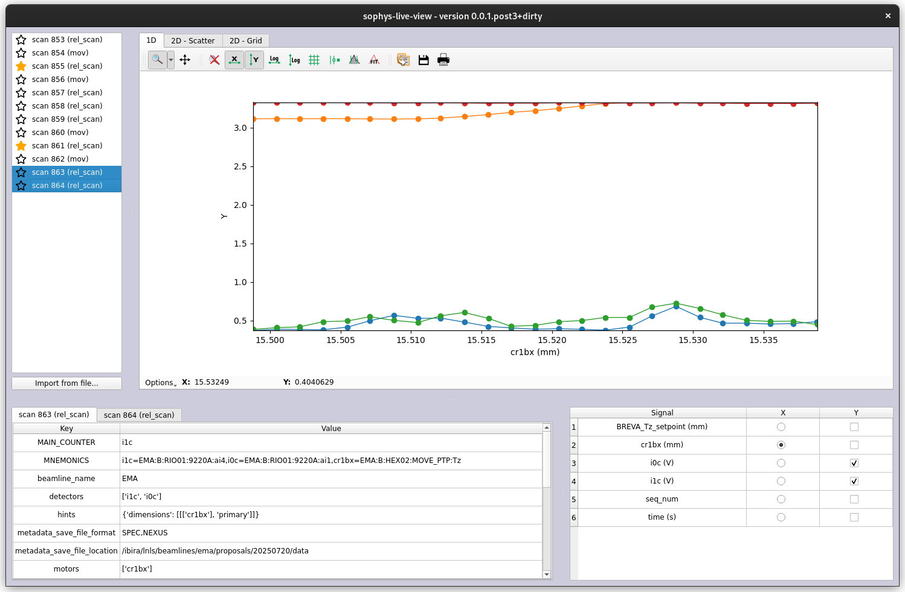

# Sophys Live View

Live data visualization interface for usage in Bluesky-based systems.



This interface implements some useful functionalities for beamline users to see and compare data, such as:

- Live visualization of running scans
- 1D and 2D data support
- Multi-signal plotting on the same graph
- Plotting of signals from various runs at once
- Control of independent and dependent axes
- Bookmark of special runs for later retrieval
- Metadata visualization of scan parameters
- Retrieval of old runs via a time offset on initialization
- Visualization of previous runs via a file import system

The application is structured in four main components, as follows:

- On the top left side, there's a run selector, which displays previous and ongoing runs for the user to select.
One can select multiple runs at once by dragging the selection or using the Ctrl key. One can also bookmark a run
to create a visual indication for it by double-clicking a run.

- On the bottom left side, is a metadata visualizer, which creates a tab for each selected run, and displays the
metadata associated with each run. The table supports copying of entries via Ctrl+C or via the right click menu.

- On the bottom right corner, there's a signal selector, for configuring independent and dependent variables in the
plots. It reacts to the current plot type selected on the plot display, and shows the signals accordingly. It also
retrieves default values for such variables from the stream metadata it receives.

- On the top right side, there's the main plot display. There are tabs for each plot type, which do not automatically
get selected, to give the user more freedom of choice. The plots are taken from silx, and so they have all the inherited
functionality, like extra options on the 1D plot on the bottom left corner. This view uses the runs selected on the run
selector and the signals selected on the signal selector to decide what to draw on the screen.

## 📦 Installation
```sh
micromamba create -f environment.yml
micromamba activate sophys_live_view_env
```


```sh
cd sophys_live_view
pip install .
```

Run your gui

```sh
sophys_live_view

```

For development:
```sh
pip install -e ".[dev]"
pre-commit install
```
